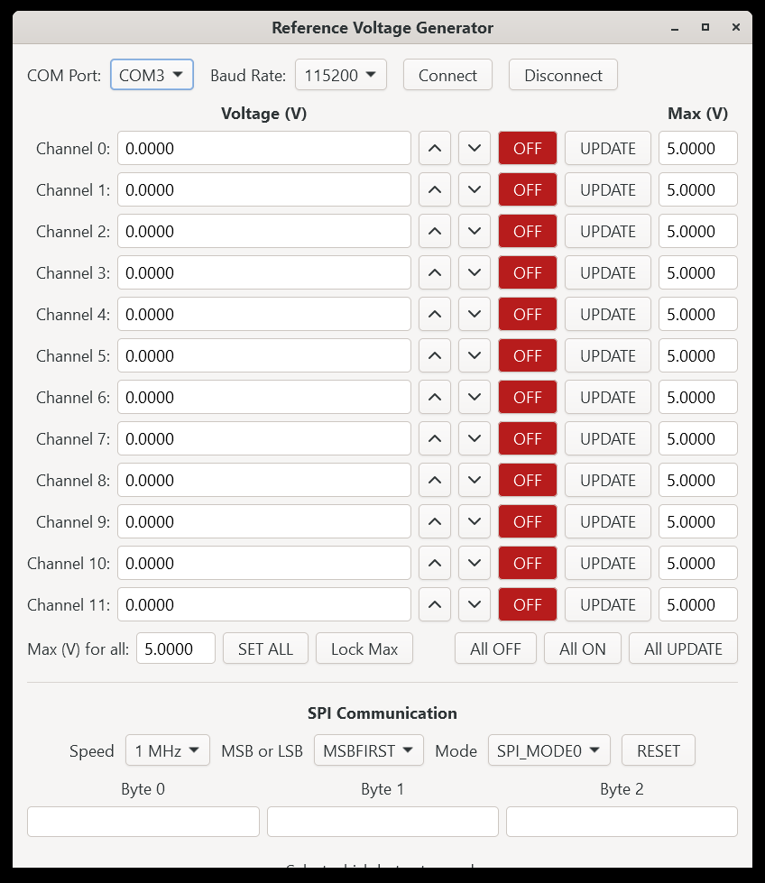
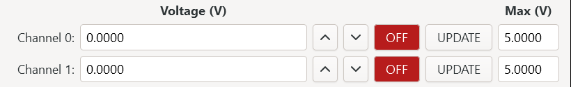
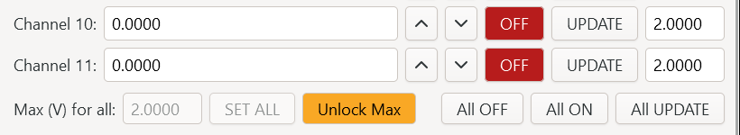
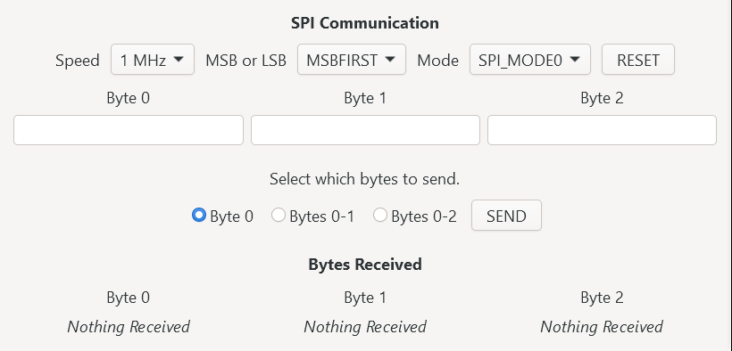
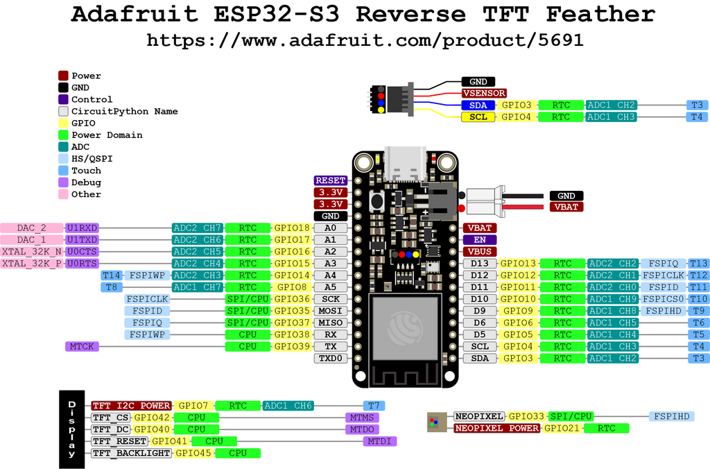
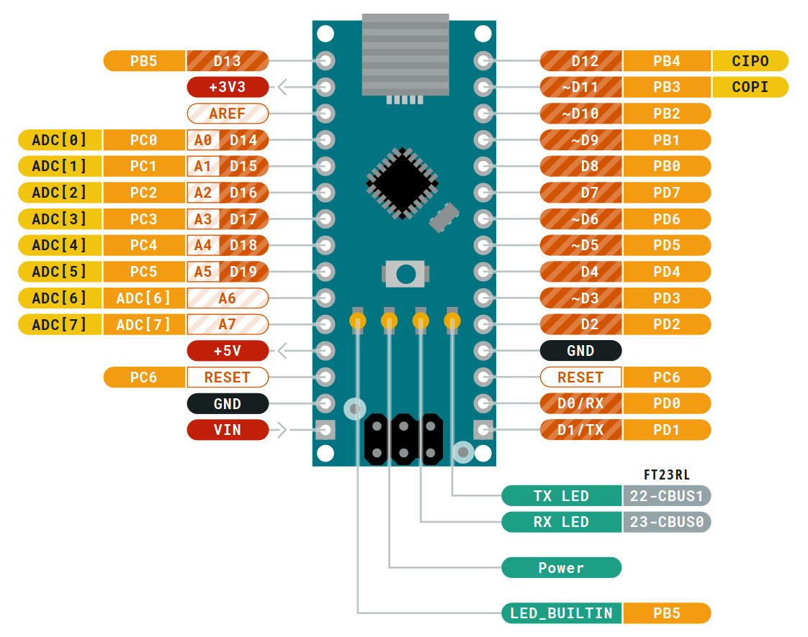

# Reference Voltage Generator

> This is a fork of [scguerrero/ReferenceVoltageGenerator](https://github.com/scguerrero/ReferenceVoltageGenerator),
> originally written by **S. C. Guerrero** ([@scguerrero](https://github.com/scguerrero)), who authored the
> GUI, the Feather and Nano sketches, and the documentation this README is built on.
> See [Credits](#credits). This fork adds GUI v2.0; everything else is upstream work.

- [Repository Layout](#repository-layout)
- [Initiating Serial Communication](#initiating-serial-communication)
- [Entering Voltage Values](#entering-voltage-values)
- [SPI Communication](#spi-communication)
- [Changes in GUI v2.0](#changes-in-gui-v20)
- [How to Run the GUI on Windows](#how-to-run-the-gui-on-windows)
- [How to Build GUI v2.0](#how-to-build-gui-v20)
- [How to Compile Natively on Linux](#how-to-compile-natively-on-linux)
- [How to Cross-Compile on Linux](#how-to-cross-compile-on-linux)
- [How to Upload Sketch to Adafruit Feather](#how-to-upload-sketch-to-adafruit-feather)
- [How to Upload Sketch to Arduino Nano](#how-to-upload-sketch-to-arduino-nano)
- [How to Wire Feather to Nano](#how-to-wire-feather-to-nano)
- [Known Issues](#known-issues)
- [Credits](#credits)

Reference Voltage Generator is a set of programs in which a user can enter voltage values to a graphical user interface (GUI) and a microcontroller responds to GUI events by sending those voltage values to digital-to-analog converters (DACs). The GUI application in Figure 1 was developed on Linux in C using GTK4. It builds natively on Linux and on Windows via MSYS2, and can also be cross-compiled to Windows using Linux as the host machine; a precompiled Windows executable of v1.0 is included as well. The GUI was designed to communicate with an Adafruit Feather ESP32-S3 Reverse TFT. The Feather application parses commands received from the GUI and determines if the command intends to send a voltage value to one of the DACs via I2C, or if the command is meant to send bytes to another microcontroller via SPI.

## Repository Layout
[Jump to Top](#reference-voltage-generator)

The repository holds two generations of the GUI. Both speak the same protocol to the same firmware, so either can drive the board.

| Directory | Contents |
| :--- | :--- |
| `GUI_v2.0/` | **The current GUI**, split across `src/` and built with a `Makefile`. This is the version documented below. |
| `GUI_v1.0/` | The original single-file GUI (`main.c`), kept for reference, plus the Feather and Nano sketches and the prebuilt `windows_app/`. |
| `VHDL/` | I2C master implementation and simulation files. |
| `images/` | Figures used by this README. |

**This README documents GUI v2.0.** Where v1.0 behaved differently, the difference is listed under [Changes in GUI v2.0](#changes-in-gui-v20). The Feather and Nano sketches are shared by both versions.


*Figure 1. Graphical user interface.*

## Initiating Serial Communication
[Jump to Top](#reference-voltage-generator)


*Figure 2. Controls for serial port, baud rate, and initiating connection.*

The user begins by selecting a serial communication port from the COM Port dropdown menu in Figure 2. The listed ports are COM1–COM16, followed by `/dev/ttyUSB0`, `/dev/ttyUSB1`, `/dev/ttyACM0`, and `/dev/ttyACM1`. Windows users should select from COM1–COM16; users on other operating systems should select one of the device paths. Command-line utilities such as `lsusb` on Linux, or Device Manager on Windows, may help the user determine which serial port their target device (e.g. a microcontroller) is connected to.

The port preselected when the window opens is COM3 on Windows and `/dev/ttyACM0` elsewhere. To change the default, or to list ports above COM16, edit `DEFAULT_PORT_NAME` and `MAX_COM_PORT` in `GUI_v2.0/src/config.h`.

The user can also select a baud rate from the next dropdown menu. Available baud rates are 1200, 2400, 4800, 9600,19200, 38400, 57600, 115200, 230400, 460800, and 921600. The user should select the appropriate baud rate for their target device by reading their device’s datasheet.

After the user selects a COM Port and Baud Rate and clicks the Connect button, the application will attempt to connect to the target device with those settings. Progress and errors are printed to the terminal the application was launched from, so it is worth keeping that window visible. Clicking Disconnect closes the port.

The user should troubleshoot by verifying that the COM Port and Baud Rate are correct, disconnecting and reconnecting their device, and checking if their cable is “charge-only.” A cable designed only for charging battery is not the same as a cable meant for data transfer, which is the type of cable required for serial communication.

## Entering Voltage Values
[Jump to Top](#reference-voltage-generator)

The user can enter values for twelve channels, numbered Channels 0–11. Figure 3 shows Channels 0–1.


*Figure 3. Column headers and Channels 0–1.*

Each row carries a target voltage on the left and that channel’s own upper limit in the Max (V) column on the right. Values are entered in volts and displayed to four decimal places, snapped to the nearest 100 µV.

The value can be increased or decreased by 0.1 V at a time by clicking the Arrow-Up and Arrow-Down buttons next to the corresponding voltage entry. Stepping preserves whatever offset the value already had, so a typed 1.2345 V steps to 1.3345 V rather than snapping to a round number.

### Voltage limits

Two separate limits apply.

- **5 V is the fixed hardware full scale.** It is the voltage a DAC code of `0xFFFF` produces, so it is a property of the board rather than a preference, and it cannot be changed from the GUI.
- **Each channel has its own maximum**, shown in the Max (V) column. It can be set to anything from 0 V up to the 5 V hardware limit, and it defaults to 5 V.

Out-of-range entries are clamped automatically. A value of –1 is forced to 0, and a value above the channel’s maximum is forced down to it. Clamping is applied on every route that can change a value: typing, pressing Enter, leaving the field, the arrow buttons, UPDATE, and All UPDATE. Lowering a channel’s maximum below its current target pulls that target down too, so a displayed value is never one the channel would refuse to send.

Setting a lower maximum limits the voltage; it does not rescale the conversion. A channel capped at 1.5 V simply cannot be driven past the DAC code for 1.5 V.

### ON/OFF and UPDATE

Figure 3 also shows ON/OFF and UPDATE buttons. The ON/OFF button is a two-state toggle that begins in state OFF. When the OFF state is toggled, the application sends a command to power off the corresponding DAC (e.g. Toggling Channel 0 OFF will power off DAC 0). When UPDATE is clicked, the application sends a command to the Feather containing the DAC number and voltage value, and the Feather applies the voltage value to the right DAC. When the ON state is toggled, the application sends a command to power on the same DAC with the last voltage value that was written to it.

Commands are sent over the connection opened by the Connect button. Note that sending while disconnected currently fails silently: the terminal still prints the bytes as though they had gone out.

### Bulk controls


*Figure 4. Bulk controls below Channel 11.*

Below Channel 11, on the right, are All OFF, All ON, and All UPDATE. The first toggles the OFF state for each ON/OFF button and the second toggles the ON state; both update the buttons only. All UPDATE sends one voltage command at a time for each channel, starting from DAC 0.

On the left are three controls for working with the maxima together:

- **Max (V) for all** — a value to apply to every channel at once. Each channel clamps it independently. The box echoes back what was actually accepted, so an out-of-range entry cannot sit there looking as though it took effect.
- **SET ALL** — applies that value to all twelve channels. Pressing Enter in the entry does the same.
- **Lock Max** — freezes every maximum.


*Figure 5. The maxima set to 2 V and locked. The Max fields and bulk controls are frozen; the voltage entries stay editable.*

While locked, the button turns amber and reads Unlock Max, the per-channel Max fields stop accepting input, and the bulk maxima controls are greyed out. The lock covers the ceilings only — voltage entries, UPDATE, and All OFF/ON/UPDATE keep working, so a set of limits can be fixed at the start of a session and then left alone. Locked values stay in plain black text rather than greyed out, so a limit remains easy to read at a glance.

The maxima and the lock state are not saved between runs. Every launch starts unlocked with all twelve limits back at 5 V.

## SPI Communication
[Jump to Top](#reference-voltage-generator)

In Figure 6, the user can enter three bytes of data in hexadecimal format. The byte entries accept hex digits only; other characters are rejected with an error bell. The user can choose to send the first byte, the first and second byte, or all three bytes, with Byte 0 selected by default. The application was tested to send user-inputted bytes through the Feather to an Arduino Nano via SPI. It was also tested to receive bytes from the Nano, through the Feather, and display the received bytes on the application window. The text will read “Nothing received” until bytes arrive at the Feather’s serial port from the Nano.


*Figure 6. SPI section of the GUI where the user can send bytes and view received bytes.*

The Speed, MSB/LSB, and Mode dropdowns describe the intended bus configuration. Speed is shown in readable units — the dropdown reads `1 MHz` rather than `1000000`. **These three settings are not yet transmitted**; the firmware currently uses its own compiled-in SPI configuration. They are printed to the terminal on each send so the intended settings are visible while that side is finished. Additional clock rates can be added to `SPI_SPEEDS_HZ` in `GUI_v2.0/src/spi_panel.c`, and their labels will be generated automatically in Hz, kHz, or MHz.

RESET writes the Reset pin, which is an ordinary GPIO on the microcontroller.

## Changes in GUI v2.0
[Jump to Top](#reference-voltage-generator)

The behaviour described above is v2.0. This section records what changed from v1.0.

### New features

- **Per-channel voltage maxima.** In v1.0 a single hard-coded 5 V constant served two unrelated purposes: the DAC full-scale reference used to convert a voltage into a 16-bit code, *and* the clamp applied to the entry boxes. v2.0 separates them, keeping 5 V as the fixed hardware full scale and giving each channel its own editable ceiling. Defaults to 5 V, so out of the box the behaviour matches v1.0.
- **Bulk maxima controls.** Max (V) for all and SET ALL apply one limit to all twelve channels.
- **A lock for the maxima.** Lock Max freezes every ceiling until it is unlocked, leaving the voltage entries usable.
- **Arrow buttons step by 0.1 V** instead of 100 µV, which is a more practical amount to nudge a bias by. Entries still display and round on the 100 µV grid.
- **The COM port dropdown lists COM1–COM16**, up from COM1–COM8. The default selection is now looked up by name rather than by a hard-coded index, so lengthening the list cannot silently change which port is preselected.
- **SPI clock rates are shown in readable units** — `1 MHz` rather than `1000000`. Rates are stored in hertz and the labels are generated, choosing Hz, kHz, or MHz automatically.

### Structural changes

- **The source is split into modules.** `GUI_v2.0/src/` separates the serial layer, the wire protocol, the connection row, the channel grid, the SPI panel, the receive monitor, and the window assembly, replacing the single 1000-line `main.c`. See the comment at the top of `src/main.c` for a map.
- **A `Makefile` replaces the hand-typed `gcc` line**, with header dependency tracking and a `clean` target.

### Bug fixes

- **`main.c` did not compile on Windows.** A missing semicolon in the Win32 serial setup (`WriteTotalTimeoutConstant`) meant the `_WIN32` branch had never been through a compiler; the shipped binary was a Linux build, so this went unnoticed.
- **All UPDATE did nothing while connected.** It opened a second handle to the port from the dropdowns instead of reusing the one the Connect button opened. Since the port is opened without sharing, that second open always fails on Windows and the button silently did nothing. It now sends over the shared connection, like the per-channel UPDATE buttons.
- **The Windows serial reader thread never exited.** After a disconnect it kept spinning on a closed handle. It now stops when the read fails.
- **The ON/OFF button colours never appeared.** The code set widget names for styling but no CSS provider was ever loaded, so the names had no effect. ON is now green and OFF red.
- **Hex validation on the SPI byte entries was never wired up.** The validating handler existed in full but was not attached to any event controller, so the fields accepted any character.
- **SEND could ship an empty frame**, because no byte-count radio button started selected. It now defaults to Byte 0.

### How to Run the GUI on Windows
[Jump to Top](#reference-voltage-generator)

This is the prebuilt **GUI v1.0** executable. To build v2.0 yourself, see [How to Build GUI v2.0](#how-to-build-gui-v20).

Clone the repository and enter the `windows_app` directory. This directory contains DLLs (Dynamic-Link Libraries) that the Windows executable requires. 
```
git clone https://github.com/AhanDatta/ReferenceVoltageGenerator.git
cd ReferenceVoltageGenerator/GUI_v1.0/windows_app
```
Open this directory in your file manager and double-click the executable ReferenceVoltageGenerator.exe.

### How to Build GUI v2.0
[Jump to Top](#reference-voltage-generator)

v2.0 is built with its `Makefile` rather than a single `gcc` invocation, because the source is now spread across several files.

**On Linux:**
```
sudo apt install build-essential libgtk-4-dev pkg-config
cd GUI_v2.0
make
./main
```

**On Windows**, natively, with [MSYS2](https://www.msys2.org/). Open the *MinGW 64-bit* shell (not the plain MSYS shell) and install the toolchain and GTK4:
```
pacman -S --needed mingw-w64-x86_64-gcc mingw-w64-x86_64-gtk4 \
                   mingw-w64-x86_64-pkgconf mingw-w64-x86_64-make
cd GUI_v2.0
mingw32-make
./main.exe
```

Use `mingw32-make`, not the msys `make`. The latter strips `TMP` from the environment when it launches the native compiler, and gcc then fails with `Cannot create temporary file in C:\WINDOWS\`.

The resulting `main.exe` needs the GTK DLLs on its `PATH`, so it will not run from a double-click until `C:\msys64\mingw64\bin` is on `PATH` or the DLLs are copied next to the executable as in `GUI_v1.0/windows_app/`.

`make clean` removes the objects and the binary. Header dependencies are tracked, so editing a header rebuilds only the files that include it.

To cross-compile v2.0 to Windows from Linux, follow [How to Cross-Compile on Linux](#how-to-cross-compile-on-linux) to set up quasi-msys2, then override the compiler and output name:
```
make CC=x86_64-w64-mingw32-gcc BIN=ReferenceVoltageGenerator.exe
```

### How to Compile Natively on Linux
[Jump to Top](#reference-voltage-generator)

This section covers **GUI v1.0**, which is a single source file. For v2.0 see [How to Build GUI v2.0](#how-to-build-gui-v20).

Clone the repository, open it, compile `main.c`, and run it with `./main`.
```
git clone https://github.com/AhanDatta/ReferenceVoltageGenerator.git
cd ReferenceVoltageGenerator/GUI_v1.0
gcc $(pkg-config --cflags gtk4) -o main main.c $(pkg-config --libs gtk4) -lm
./main
```

### How to Cross-Compile on Linux
[Jump to Top](#reference-voltage-generator)

The `gcc` invocation below builds **GUI v1.0**. The quasi-msys2 setup applies to both versions; for v2.0, run `make CC=x86_64-w64-mingw32-gcc BIN=ReferenceVoltageGenerator.exe` inside the shell instead of the command shown here.

Install [quasi-msys2](https://github.com/HolyBlackCat/quasi-msys2) according to the instructions for your Linux distribution in the [Usage](https://github.com/HolyBlackCat/quasi-msys2#usage) section.

When the installation is complete, enter the `quasi-msys2` directory. Open the shell and compile `main.c` inside the environment.

```
env/shell.sh # Open the shell

# Cross-compile the executable named ReferenceVoltageGenerator.exe
x86_64-w64-mingw32-gcc main.c -o ReferenceVoltageGenerator.exe `pkg-config --cflags --libs gtk4` -lm

ls # Check that the exe was created by looking at the list of files
exit # Close the shell
```

Create a new directory, *not* inside `quasi-msys2`, called `windows_app` (any name will work as long as it indicates that it's for Windows). Copy the Windows executable you just created to this new directory. Copy the Windows DLLs (Dynamic-Link Libraries) to this new directory as well.

```
# In a different directory that isn't quasi-msys2
mkdir windows_app

# Copy the exe to the new directory
# IMPORTANT: Adjust path to where your quasi-msys2 directory is located on your computer
cp /path/to/quasi-msys2/ReferenceVoltageGenerator.exe /path/to/windows_app/

# Copy the DLLs to the new directory
cp -r /path/to/quasi-msys2/root/ucrt64/bin/ /path/to/windows_app/
```

To test the Windows executable on Linux, use Wine to run it.

```
cd windows_app

# Set Wine display and language settings to avoid seeing corrupted fonts in the GUI
PANGOCAIRO_BACKEND=fc LANG=en_US.UTF-8 WINEPATH="bin/" wine ReferenceVoltageGenerator.exe
```

If it runs with readable fonts, then it is safe to run natively on Windows. Always run the Windows executable inside the folder with the DLLs. It will fail to execute if it does not have access to them. The author is aware of this issue and will update this section when she solves it.

### How to Upload Sketch to Adafruit Feather
[Jump to Top](#reference-voltage-generator)

The GUI is designed to communicate with an Adafruit Feather ESP32-S3 Reverse TFT. Uploading Arduino sketches to the Feather through Arduino IDE is error-prone on Ubuntu Linux, so this project uses [esptool](https://github.com/espressif/esptool) to upload Arduino sketches to the Feather on the command line. Windows users likely will not encounter this issue and can use Arduino IDE to upload sketches to the Feather as normal. 

Arduino IDE can still be used to write/edit sketches for the Feather. Open the file `esp32_voltage_generator.ino` with Arduino IDE and, if applicable, allow the IDE to automatically place the `.ino` inside of a new folder. Choose the Feather in the board/port dropdown menu next to the Verify/Upload/Debug circle icons. Click Verify to check for syntax errors. Next, in the top ribbon toolbar, click Sketch > Export Compiled Binary. This will generate binary files that can be flashed to the Feather.

Open the folder containing the `.ino` file. It will contain a new subdirectory called `build/esp32.esp32.adafruit_feather_esp32s3_reversetft`. Open that subdirectory. Use `ls` to check for the following files:
```
esp32_voltage_generator.ino.bootloader.bin
esp32_voltage_generator.ino.partitions.bin
esp32_voltage_generator.ino.bin
```
These will be flashed to the Feather using esptool.

Before flashing, put the Feather in ROM bootloader mode by holding the D0 button, clicking the Reset button on the TFT side (still holding D0), then releasing D0. Check that the Feather is bootloader mode by running `lsusb`. If `lsusb` shows a device with the name `Espressif`, then it is ready for flashing. If the device says `Adafruit`, try again before proceeding.

After confirming that the Feather is in ROM bootloader mode, use esptool to flash the three files listed above to the board.
```
# Try this first
esptool --chip esp32s3 --port /dev/ttyACM0 --baud 921600 write_flash -z \
  0x0 esp32_voltage_generator.ino.bootloader.bin \
  0x8000 esp32_voltage_generator.ino.partitions.bin \
  0x10000 esp32_voltage_generator.ino.bin
  
# If esptool does not work, try this path instead
~/.local/bin/esptool.py --chip esp32s3 --port /dev/ttyACM0 --baud 921600 write_flash -z \
  0x0 esp32_voltage_generator.ino.bootloader.bin \
  0x8000 esp32_voltage_generator.ino.partitions.bin \
  0x10000 esp32_voltage_generator.ino.bin
```
Click the Reset button on the side opposite of the TFT to boot the newly uploaded sketch.

### How to Upload Sketch to Arduino Nano
[Jump to Top](#reference-voltage-generator)

Arduino IDE should work without issue on Linux when uploading sketches to Arduino boards.

Open the file `spi_nano.ino` with Arduino IDE and, if applicable, allow the IDE to automatically place the `.ino` inside of a new folder. Choose the Arduino Nano in the board/port dropdown menu next to the Verify/Upload/Debug circle icons. Click Verify to check for syntax errors, then click Upload. The Nano will immediately load the new sketch.

## How to Wire Feather to Nano
[Jump to Top](#reference-voltage-generator)

Each row in the table indicates which pins to connect together. SCK on the Feather to D13 on the Arduino, and so on.
| Feather | Arduino |
| :--- | :--- |
| SCK | D13 |
| MOSI | D11 |
| MISO | D12 |
| D5 | D10 |
| GND | GND |


*Figure 7. Adafruit Feather ESP32-S3 Reverse TFT pinout.*


*Figure 8. Arduino Nano pinout.*

## Known Issues
[Jump to Top](#reference-voltage-generator)

Open a "New Issue" at the top of the page if something is not covered here.

- The SPI speed, bit order, and mode dropdowns are read and logged but are **not yet transmitted**. The firmware still uses its own compiled-in SPI configuration, so choosing one of the four SPI modes in the GUI has no effect on the bus yet
- Only one SPI clock rate (1 MHz) is offered. Further rates can be added to `SPI_SPEEDS_HZ` in `GUI_v2.0/src/spi_panel.c`, and their labels will be generated automatically
- A blank hex byte entry is sent as `0x00` rather than being rejected, so an unfilled box is indistinguishable from a deliberate zero
- Per-channel maxima and the lock state are **not saved between runs**. Every launch starts unlocked with all twelve limits back at 5 V
- Sending while disconnected fails silently. The guards that would report it are commented out, so the terminal prints the bytes as though they were sent
- All ON and All OFF update the toggle buttons but do not send power commands to the DACs
- Windows executable DLLs should be statically linked to create a self-contained executable. Until then the executable needs the GTK DLLs on its `PATH`

## Credits
[Jump to Top](#reference-voltage-generator)

This project was created by **S. C. Guerrero** ([@scguerrero](https://github.com/scguerrero)). The upstream repository is
[scguerrero/ReferenceVoltageGenerator](https://github.com/scguerrero/ReferenceVoltageGenerator).

The original author wrote the GUI that v2.0 is built on, the Adafruit Feather and Arduino Nano sketches, the VHDL I2C master, the pinout figures, and the structure and much of the prose of this README — including the firmware, wiring, and cross-compilation sections, which are essentially unchanged.

This fork is maintained by **Ahan Datta** ([@AhanDatta](https://github.com/AhanDatta)) and adds GUI v2.0: the per-channel voltage ceilings, the bulk maxima controls and lock, the larger arrow step, the extended port list, the readable SPI clock labels, the modular source layout, and the fixes listed under [Changes in GUI v2.0](#changes-in-gui-v20).

Work carried out in the Frisch group as part of the LAPPD/PSEC effort.
